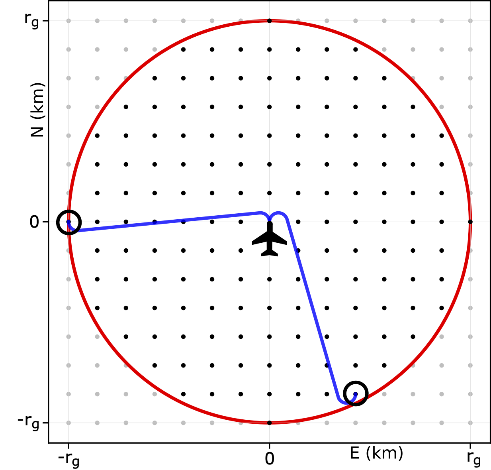
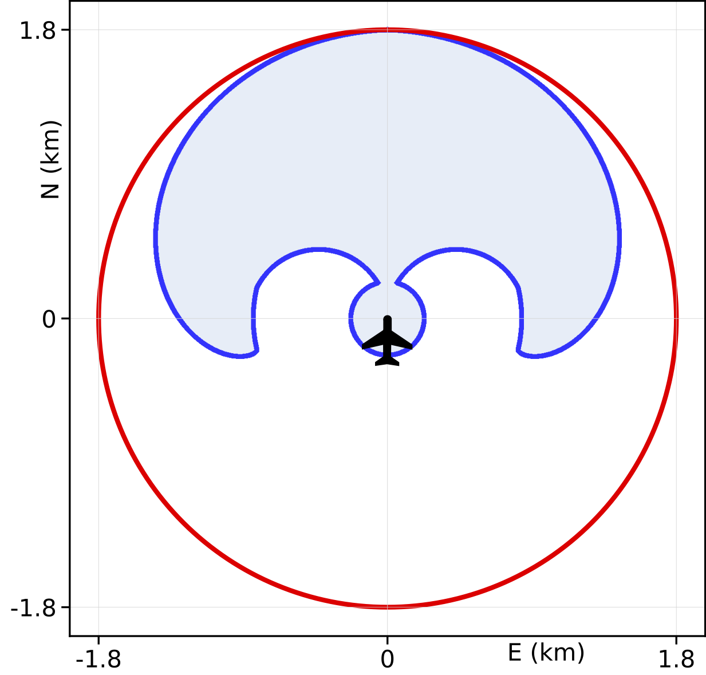
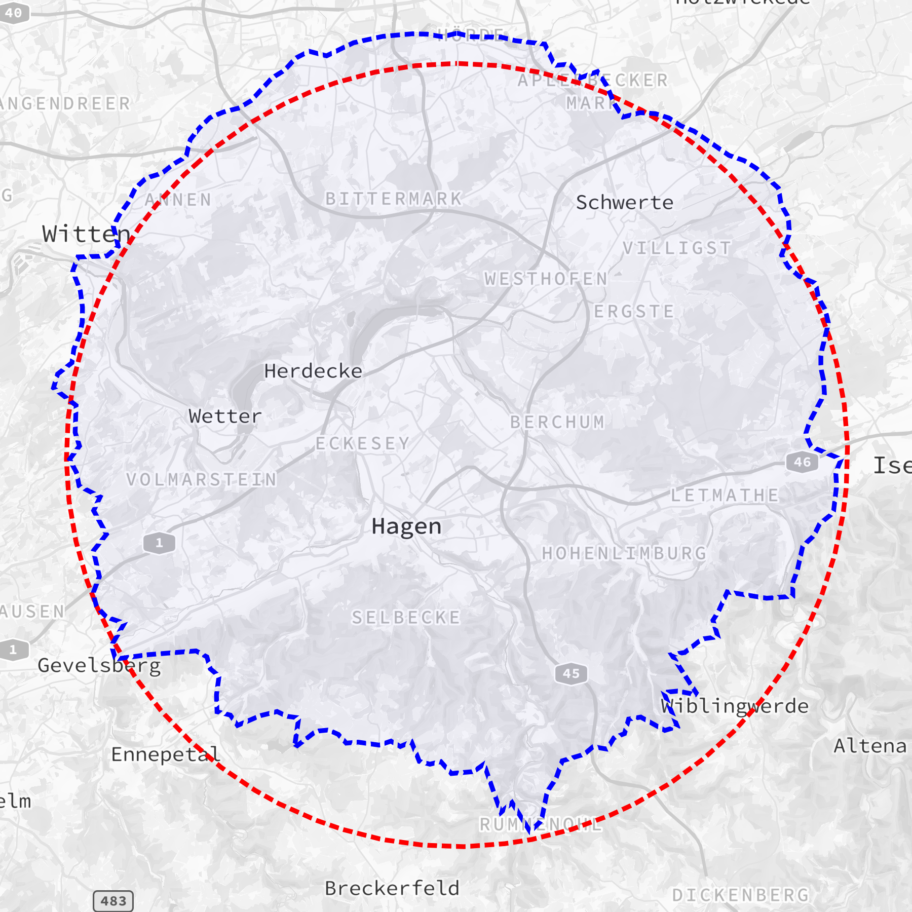

# Dubins-Based Analysis of Glide Ring Accuracy


A total loss of thrust presents a critical challenge for pilots, requiring rapid and precise decision-making to ensure a safe emergency landing. Assistance systems typically estimate the reachable area using the glide ring, which assumes straight-line gliding and neglects necessary turning maneuvers. This repository provides code to visualize and analyze the inaccuracies of the glide ring caused by this simplification, comparing it with more precise [Dubins](https://doi.org/10.2307/2372560)-based glide paths.

### Geodetic Coordinate Transformation

Aircraft and landing positions are often given in WGS84 geodetic coordinates $(\phi, \lambda, h)$, representing latitude, longitude, and height above the reference ellipsoid. For Dubins path planning, these are transformed into a local [ENU](https://www.mathworks.com/help/map/choose-a-3-d-coordinate-system.html) coordinate system, defined by a reference point $(\phi_{ref}, \lambda_{ref}, h_{ref})$.

Orientation in aviation is typically referenced to True North. Since Dubins curves use a heading relative to the x-axis, the true course $\theta_{\text{WGS84}}$ must be converted into an ENU-compatible angle by adjusting the reference direction:

$\theta_{\text{ENU}} = (90^\circ - \theta_{\text{WGS84}}) \bmod 360^\circ$

The following example uses geodetic coordinates near EDNX to transform aircraft and runway positions into a local ENU system:

```python
from geography import GeoCoordinates, GeoPose

# Define geodetic coordinates (latitude, longitude, altitude)
plane_geo = GeoCoordinates(48.242007, 11.544137, 886)
runway_geo = GeoCoordinates(48.2384, 11.5547, 486)  # Runway 07
ref_geo = GeoCoordinates(plane_geo.lat, plane_geo.lon, plane_geo.alt - 600)  # Ground point under the aircraft (flying at 1000m AGL)

# Convert to ENU coordinates
plane_pose = GeoPose(plane_geo, 279).to_enu(ref_geo)
runway_pose = GeoPose(runway_geo, 75).to_enu(ref_geo)

# The resulting poses can now be used for path planning
```

### Calculate and visualize Dubins paths

Dubins curves describe the shortest path between two positions with given orientations under a constant speed and constrained turning radius. A Dubins vehicle moves in the plane with motion governed by

$\dot{x} = v_a \cos{\theta}, \quad \dot{y} = v_a \sin{\theta}, \quad \dot{\theta} = \omega$

where $\vec{x} = (x,y)$ represents the position, and $\theta$ is the orientation (relative to the x-axis).

The `DubinsPlanner` provided in this repository computes 2D Dubins paths (independently of glide path calculations):

```python
from dubins import DubinsPlanner
from plot import plot_paths

# Configuration Cessna 172 SP
turn_radius = 209.8

# Use start and end pose from geodetic transformation before.
# Or create start pose and end pose as needed.

# Calculate Path
shortest_path = DubinsPlanner.paths(plane_pose.xy(), runway_pose.xy(), turn_radius)[0]

# Plot Path
velocity = 30 
plot_paths([(shortest_path, velocity)], [str(shortest_path)])
```

### Evaluation of Glide Ring Accuracy

To determine which points within the glide ring of radius $r_g$ are definitely not reachable for a given aircraft and runway configuration, the optimal Dubins path is computed for each grid point inside the ring. Each point represents a potential landing location, all sharing the same orientation within one grid:

<p align="center">
  
</p>

The altitude loss along the optimal Dubins path is then evaluated: If it exceeds the available altitude, the point is classified as not reachable, since no alternative path would require less height (assuming that the glide ratio for straight flight is greater than for curved flight).

The following example computes and visualizes reachable points in the glide ring for a Cessna 172 SP flying at 150m AGL with both the aircraft and runway oriented toward true north:

```python
import numpy as np
from primitives import Pose3d
from reachability import Reachability
from plot import plot_grid

# Aircraft model: Turn radius, glide ratio straight and curve, sink rate straight
cessna = (209.8, 11.744, 10.068, 2.934) 

# Configuration
alt, runway_heading = 150, np.pi/2 
plane_pose = Pose3d.at(0, 0, alt, runway_heading)

# Evaluate grid points
grid = Reachability.plane_grid(*cessna, plane_pose, runway_heading)

# Plot glide ring with reachable points
glide_radius = Reachability.glide_radius(cessna[1], alt)
plot_grid(grid, glide_radius, plane_pose.xy().position)
```

<p align="center">
  
</p>

The glide ring accuracy can then be expressed as the ratio of actually reachable points to all grid points within the glide ring. Since this accuracy depends on altitude and the orientation difference between aircraft and runway, it only represents a single case. However, the method can be extended to evaluate an accuracy across multiple altitudes and orientations, leading to generalized results, as presented in the research paper associated with this repository.

### Impact of a Constant Wind Vector

To account for wind influence, the Dubins motion equation is extended by introducing a constant wind vector in the plane. If the aircraft’s position is normalized such that its speed is 1, and the orientation is aligned with the wind direction, the new motion equation becomes:

$\dot{x} = \cos{\theta} + \chi, \quad \dot{y} = \sin{\theta}, \quad \dot{\theta} = \omega$

where $\chi$ is the ratio of wind speed to aircraft speed, constrained by $|\chi| < 1$. As a result, Dubins paths deform into trochoidal curves in the ground-fixed frame. However, in the wind-fixed frame, paths remain circular, while the stationary runway appears as a moving target drifting opposite to the wind vector.

Each point along the moving target’s trajectory is defined by its distance d from the initial position. Let:

* $t_s(d)$ be the time for the aircraft to reach $d$ with the desired final heading.
* $t_g(d)$ be the time at which the (virtual) target arrives at $d$.

The interception points are found by solving the rendezvous equation:

$G(d) = t_s(d) - t_g(d) = 0$

where $t_g(d)$ depends on wind speed and path length, and $t_s(d)$ is determined by the aircraft’s airspeed and flight path length. The goal is to find the smallest displacement $d$ where $t_s(d) = t_g(d)$.

This repository solves the problem using optimal Dubins paths. The approach first detects discontinuities in the rendezvous equation to define intervals for numerical root finding. However, in some cases, non-Dubins maneuvers are required (see, e.g., [Optimal path planning in a constant wind with a bounded turning rate](https://doi.org/10.2514/6.2005-6186)).

```python
from primitives import Vector2d
from reachability import Reachability
from plot import plot_paths

wind = Vector2d(8, 8)

# Solve rendezvous problem. Result contains shortest dubins path and path of moving target 
paths = Reachability.rendezvous_paths(plane_pose.xy(), runway_pose.xy(), plane_pose.position.z, wind, include_runway_path=True)

# Plot movement in wind-fixed frame
plot_paths([(paths[0], cessna[1] * cessna[3]), (paths[-1], wind.magnitude())], ['Aircraft', 'Runway'])
```

### Terrain-fitted Glide Ring

While a flat terrain assumption is used for general glide ring accuracy evaluation, `Reachability` also provides a function to compute a terrain-fitted glide ring.

The following example demonstrates how to generate a terrain-adapted glide ring for an aircraft located above FernUniversität in Hagen. To obtain terrain elevation data, the [elevation](https://pypi.org/project/elevation) can be used:

```bash
eio clip -o Hagen-30m-DEM.tif --bounds 7.141117 51.088924 7.864739 51.661298
```

Once the terrain data is available, the glide ring can be computed:

```python
from geography import GeoCoordinates
from reachability import Reachability

srtm_file = "Hagen-30m-DEM.tif"  # Terrain data file 
coords = GeoCoordinates(51.377093, 7.494956, 180 + 1000)  # Aircraft at 1000m AGL above FernUni Hagen

glide_straight = 11.744  # Glide ratio Cessna 172SP
Reachability.terrain_glide_ring(glide_straight, coords, srtm_file, 'hagen_glide_ring.geojson')
```

The generated glide ring is stored as a GeoJSON file, which can be used for further processing or visualization, e.g., with [Mapbox](https://www.mapbox.com):

<p align="center">
  
</p>

### Dependencies

- All project dependencies are listed in `requirements.txt`

### License

This project is licensed under the MIT License.

### Contact

- Email: [maik.asshoff@studium.fernuni-hagen.de]
